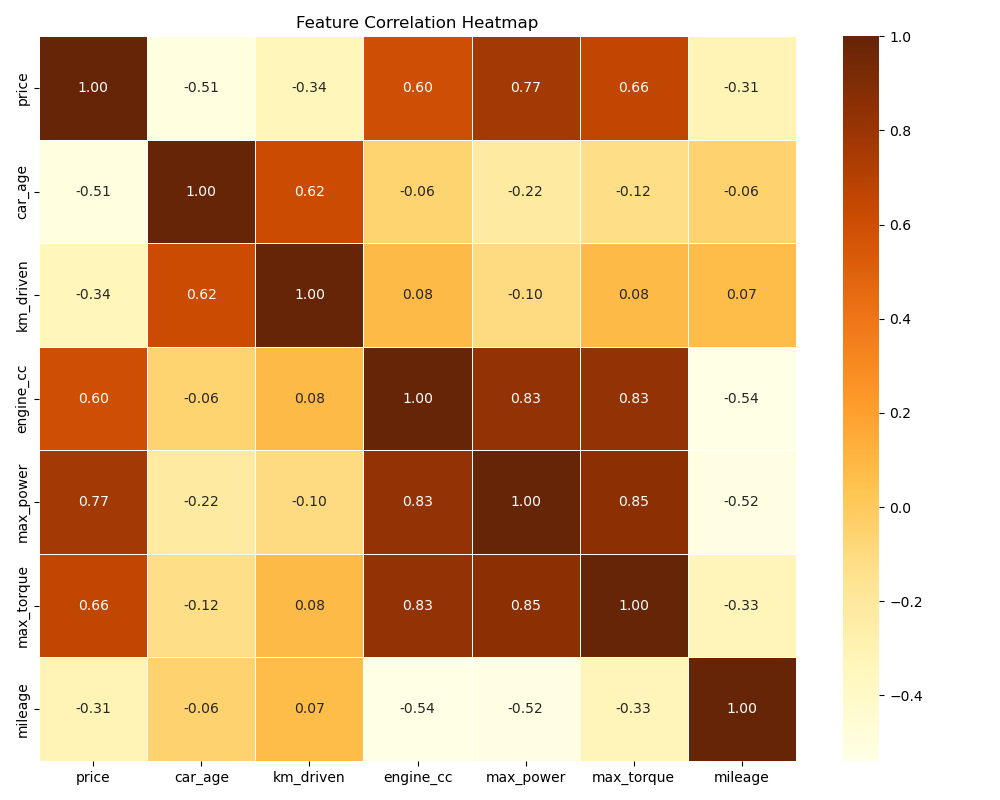

# DriveValue: Indian Used Car Valuation Engine

An enterprise-grade, machine-learning-powered used car valuation engine that combines a highly-calibrated Gradient Boosting regression strategy with a robust dataset to predict precise transaction prices across the Indian automotive market. It includes an automated preprocessing pipeline, an advanced ML training framework, and a sleek live web application.

## Dataset Link:
This logic was primarily trained using the [Kaggle CarDekho Used Cars Dataset](https://www.kaggle.com/datasets/nehalbirla/vehicle-dataset-from-cardekho).

## What It Does

DriveValue fundamentally eliminates standard machine learning hallucination phenomena by precisely mapping true market deprecation curves and aggressively distinguishing between hyper-specific car variants. 

- Consumes and structures a dataset of ~35,000 viable listings
- Parses 20 physical, contextual, and engineering-related dimensions
- Calculates mathematically scaled transaction prices rather than inflated aspirational dealer listings
- Orchestrates predictions directly via a custom dark Champagne Gold Glassmorphism web monitor
- Visualizes comparable dataset bands and expected margins seamlessly

## Architecture Overview

User opens web application 
           |
           v
   +-----------------------+
   | Streamlit Web Monitor |  <- app.py 
   +---------+-------------+
             |
             v
   +-----------------------+
   |  Inference Engine     |  <- Evaluates dynamic inputs & formats payloads
   +---------+-------------+
             |
             v
   +-----------------------+
   | Gradient Boosting ML  |  <- car_price_model_v3.pkl
   +---------+-------------+
             |
             v
   +-----------------------+
   | Feature Sub-Pipeline  |  <- model_data.py / Data Orchestration
   +---------+-------------+
             |
             v
   +-----------------------+
   |  Kaggle / Local CSVs  |  <- Raw Data Aggregation
   +-----------------------+

## Tech Stack

| Layer | Technology |
|---|---|
| **Live Application** | Python, Streamlit, HTML/Vanilla CSS |
| **Data Engineering** | Pandas, Numpy |
| **Machine Learning** | Scikit-Learn (Gradient Boosting, OrdinalEncoder) |
| **Persistence** | Pickle (.pkl), JSON reporting |

## Feature Engineering & Preprocessing

The system utilizes an aggressive processing pipeline to cleanse the market data and engineer true depreciation variables prior to any model ingestion.

| Category | Methodology & Action |
|---|---|
| **Dimension Consistency** | Missing physical dimensions (Length/Width/Height) are reconstructed utilizing cluster medians derived strictly from matching chassis and models. |
| **Statistical Boundaries** | Implementation of strict thresholds: Outliers below INR 60,000 and above INR 1.2 Crore are truncated. Mileages, RPMs, and Engine capacities beyond the 99.5th percentiles are explicitly ignored. |
| **Listing Contextualization** | Subtracting the `model_year` from current calendar year mathematically inflates valuations. DriveValue isolates the `listing_year` (e.g. 2021 context) to calculate true `car_age = listing_year - model_year`. |
| **Commercial Filtering** | `km_per_year` is dynamically crafted to separate heavily abused commercial fleet vehicles from light-use individual profiles. |
| **Price Haircuts** | Asking prices are scaled directly to closing transaction values (Dealer prices modeled at a 15% discount, Individual listings at 10%). |

## Encoding Strategy: Why Not One-Hot Encoding?

Given the extreme sparsity of the Indian vehicle market (over 800+ independent variants, models, and brands in this dataset), utilizing standard One-Hot Encoding (OHE) generates thousands of binary matrix columns resulting in the Curse of Dimensionality. 

Instead, DriveValue leverages `sklearn.preprocessing.OrdinalEncoder` piped directly into histogram-based decision trees. These tree structures naturally calculate optimal categorical splits without requiring binary expansion, improving training speed, drastically reducing memory footprint, and smoothly handling out-of-vocabulary fallbacks with `-1` encoding.

## Model Performance & Snapshot

The architecture heavily utilizes Scikit-Learn's highly optimized `GradientBoostingRegressor` after head-to-head backtesting against variants of ExtraTrees and HistGradientBoosting. 

*Performance characteristics derived directly from our latest local cross-validation block:*

| Candidate Model | R² Score | RMSE (INR) | MAE (INR) | MAPE |
|---|---|---|---|---|
| **Gradient Boosting Regressor (Winner)** | **0.9593** | **125,231** | **73,892** | **12.97%** |
| Hist Gradient Boosting | 0.9566 | 129,382 | 76,021 | 13.08% |
| Extra Trees Regressor | 0.9560 | 130,241 | 75,545 | 13.28% |

### Correlation Heatmap

We actively map collinearity out of the feature matrix prior to deployment to guard against gradient degradation.



## Setup & Installation

### Prerequisites
- Python 3.10+
- Anaconda / venv

### 1. Clone the repository
```bash
git clone https://github.com/your-username/drivevalue.git
cd drivevalue
```

### 2. Environment Setup
```bash
python -m venv .venv
source .venv/bin/activate
pip install -r requirements.txt
```

*(Note: Data binaries and massive `.pkl` matrices have been ignored via Git. Please execute the training script locally to compile the ecosystem).*

### 3. Rebuild the Infrastructure
Train the model natively using the embedded execution pipeline:
```bash
python train_model.py
```

### 4. Launch the Web Monitor
```bash
python -m streamlit run app.py
```

## Disclaimer

This project is structured for research and architectural demonstration. Market variables and underlying macroeconomic states shift iteratively; historic RMSE scaling does not inherently guarantee absolute transactional execution parity.
