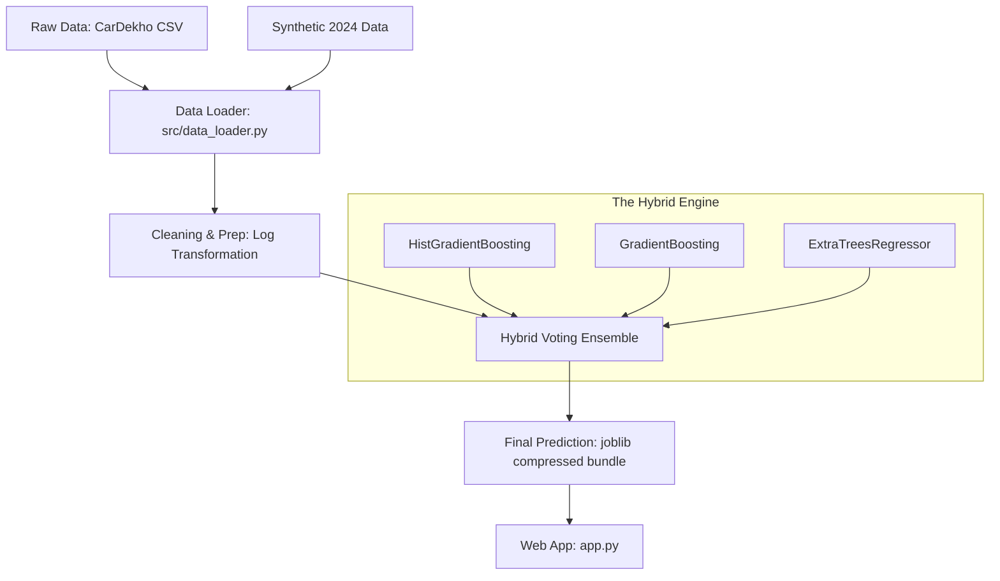

# 🤖 Car Price Prediction: Hybrid Ensemble Engine

[](https://www.python.org/downloads/)
[](https://scikit-learn.org/)
[](https://streamlit.io/)
[](https://opensource.org/licenses/MIT)

A high-performance machine learning pipeline designed to estimate used car prices in the Indian market. This project utilizes a **Hybrid Voting Ensemble**—combining the strengths of three different gradient-boosted and tree-based algorithms—to deliver stable, high-value listing estimates.

---

## 🏗️ Professional Data Pipeline

The project follows a modular, production-grade pipeline structure:



---

## 📊 Performance Benchmarks

During the training phase, we benchmarked multiple specialized models. The **Hybrid Voting Ensemble** was selected as the production model due to its superior **MAPE** (stability across all price ranges).

| Model | R² Score | MAE (Mean Error) | RMSE | MAPE (Perc. Error) |
| :--- | :---: | :---: | :---: | :---: |
| **Hybrid Voting Ensemble** | **0.9513** | **₹1,02,783** | **₹1,78,218** | **13.13%** |
| Extra Trees Regressor | 0.9531 | ₹1,02,940 | ₹1,74,964 | 13.49% |
| Hist Gradient Boosting | 0.9460 | ₹1,06,027 | ₹1,87,671 | 13.24% |
| Gradient Boosting Regr. | 0.9461 | ₹1,06,493 | ₹1,87,563 | 13.44% |

> [!TIP]
> **Why we Use MAPE**: While R² is high (95%+) for all models, **MAPE** tells us how accurate the model is relative to the car's price. The Hybrid model provides the most consistent accuracy for both budget hatchbacks and luxury SUVs.

---

## 🧠 The "Hybrid" Approach

Instead of relying on a single algorithm, we use a **Voting Regressor** that averages the predictions of three distinct models:

1.  **HistGradientBoosting**: Optimized for speed and handles missing values automatically.
2.  **GradientBoosting**: Excellent at capturing complex, non-linear relationships in the data.
3.  **ExtraTrees**: A parallel ensemble method that is highly resistant to noise and outliers.

**Benefits**:
*   **Stability**: If one model makes an "extreme" guess, the other two pull it back toward the market consensus.
*   **Generalization**: It performs better on "unseen" car variants that weren't in the original training set.
*   **Reliability**: It eliminates the bias inherent in using just a single type of decision tree logic.

---

## 📁 Repository Structure

```text
car_price_project/
├── data/
│   ├── raw/                 # Original CarDekho datasets
│   └── processed/           # Synthetic 2024 calibrated data
├── models/                  # Production artifacts (joblib compressed)
├── reports/                 # Analysis plots and training logs
├── src/                     # Core logic (Data loader & preprocessing)
├── scripts/                 # Utility scripts (Data augmentation)
├── app.py                   # Streamlit Web UI
├── train_model.py           # Training & Benchmarking Pipeline
├── requirements.txt
└── README.md
```

---

## 🛠️ Installation & Usage

1. **Clone the repository**:
   ```bash
   git clone https://github.com/arpit200004/car_price_project.git
   cd car_price_project
   ```

2. **Install dependencies**:
   ```bash
   pip install -r requirements.txt
   ```

3. **Run the Application**:
   ```bash
   streamlit run app.py
   ```

4. **Retrain the Hybrid Model**:
   ```bash
   python3 train_model.py
   ```

---

## 🙏 Credits

- Dataset provided by **CarDekho via Kaggle**.
- Core engine built with **scikit-learn**, **joblib**, and **streamlit**.

---
⭐ If you find this project useful, please star the repository!
